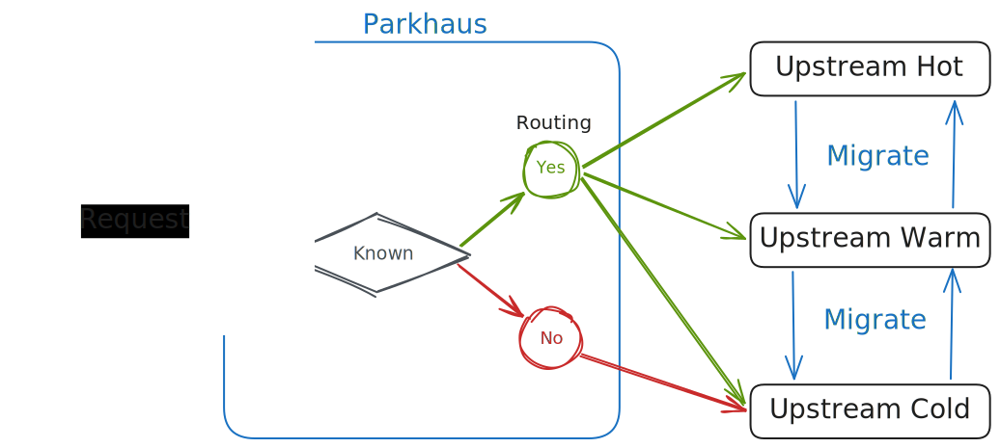

<div align="center">
  
  <!---->
  <h1>parkhaus</h1>
</div>

You found your new favorite S3-compatible storage solution but it doesn't
support object tiering? You have multiple servers, maybe a VPS with fast
internet and a local NAS with a lot of storage? Then `parkhaus` is for you!

`parkhaus` acts as a **transparent** S3 proxy, passing through requests
unaltered to the upstreams behind it — with one small twist: it records the
time of every deletion and file creation.
Using this information, `parkhaus` first routes every creation to the hottest
configured upstream, taking note of its creation time.
Afterwards, it constantly monitors its local view and migrates objects to
colder or hotter storage, depending on their age.
As of now there is no promotion rule besides editing the database, but I want
to explore moving frequently accessed objects in the future :)

<div align="center">
   <picture height="200">
     <source media="(prefers-color-scheme: dark)" srcset="./assets/architecture-dark.svg">
     <source media="(prefers-color-scheme: light)" srcset="./assets/architecture-light.svg">
     
   </picture>
</div>

## Features
- transparent S3 proxy
- records creation times while forwarding requests
- automatically migrates objects between upstreams based on lifecycle rules
- always routes requests to the correct upstream, falling back to coldest for
  unknown queries
- import your current upstreams for proper routing of existing objects

## Getting started
1. Create the buckets you want to migrate between in all upstreams. `parkhaus`
   will never create a bucket for you.
2. Create a config for `parkhaus` and configure access keys with read&write
   permissions for these buckets.
   *This is used for migration only!* No request made to `parkhaus` will use
   these credentials.
3. *Optionally*, run `parkhaus --config config.toml import` to import all
   existing objects.
4. Run parkhaus via `parkhaus --config config.toml serve`.
5. Configure parkhaus as upstream for your applications.
   Remember that `parkhaus` is a _transparent proxy_. Your application needs
   to be able to authenticate with any upstream the object might have been
   migrated to!
   **This means that your upstreams _must all know the same `key:secret` pair_
   you configure in your application.**

## Config format
```toml
listen = "0.0.0.0:8080"
metrics_listen = "0.0.0.0:8081"     # optional, disabled if unset (serves at `/metrics`)
db_path = "./tiering-test.db"

[upstreams.hot]                     # named hot, name is arbitrary
order = 1                           # smallest one is the hottest
base_url = "http://127.0.0.1:9090"
max_age = "21d"
# "path" requests "base-url/bucket"
# "virtual_hosted" requests "base-url" with a "Host" header of "bucket.base-url"
# "virtual_hosted_resolve_dns" requests to "bucket.base-url"
addressing_style = "path"
s3_access_key = "key"
s3_secret = "secret"
region = "us-east-1"

[upstreams.cold]
order = 2
base_url = "http://127.0.0.1:9091"
# no max age for the coldest
addressing_style = "path"
s3_access_key = "key"
s3_secret = "secret"
region = "us-east-1"
```
