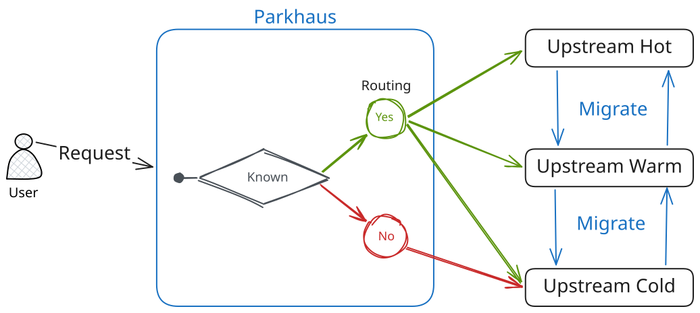
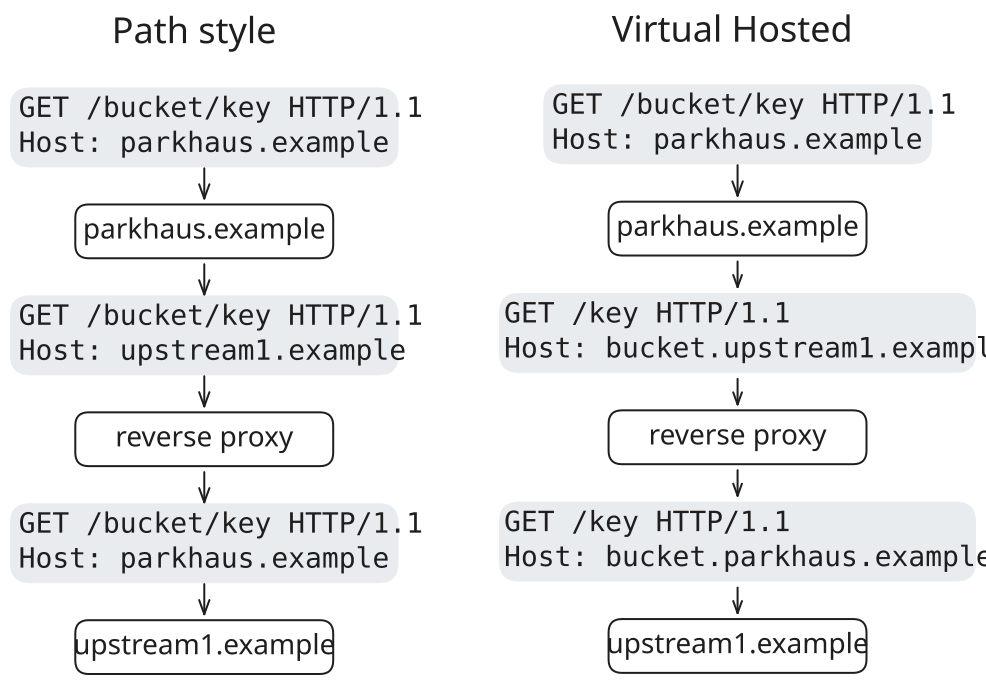

<div align="center">
  
  <!---->
  <h1>parkhaus</h1>
</div>

You found your new favorite S3-compatible storage solution, but it doesn't
support object tiering? You have multiple servers, maybe a VPS with fast
internet and a local NAS with a lot of storage? Then `parkhaus` is for you!

`parkhaus` acts as a **transparent** S3 proxy, passing through requests
unaltered to the upstreams behind it — with one small twist: it records the
time of every deletion and file creation.
Using this information, `parkhaus` first routes every creation to the hottest
configured upstream, taking note of its creation time.
Afterwards, it constantly monitors its local view and migrates objects to
colder or hotter storage, depending on their age.

<div align="center">
   <picture height="200">
     <source media="(prefers-color-scheme: dark)" srcset="./assets/architecture-dark.svg">
     <source media="(prefers-color-scheme: light)" srcset="./assets/architecture-light.svg">
     
   </picture>
</div>

## Features
- transparent S3 proxy
- records creation times while forwarding requests
- automatically migrates objects between upstreams based on tiering rules
- always routes requests to the correct upstream, falling back to coldest for
  unknown queries
- import your current upstreams for proper routing of existing objects

## Getting started
1. Create the buckets you want to migrate between in all upstreams. `parkhaus`
   will never create a bucket for you.
2. Create a config for `parkhaus` and configure access keys with read&write
   permissions for these buckets.  
   *This is used for migration/import only!* No request passed-through by
   `parkhaus` will use these credentials.
3. *Recommended*: Run `parkhaus --config config.toml import` to import all
   existing objects, to ensure requests are routed to the correct upstream and
   modification dates are known.
4. Run parkhaus via `parkhaus --config config.toml serve`.
5. Configure parkhaus as upstream for your applications.
   Remember that `parkhaus` is a _transparent proxy_. This imposes a few unique
   requirements, have a look at the [setup requirements](#setup-requirements).

### Setup requirements
- Your application needs to be able to authenticate with any upstream the
  object might have been migrated to. Therefore, your upstreams _must all know
  the same `key:secret` pairs_ you configure in your application.
- The S3 protocol allows clients to generate pre-signed URLs without
  communicating with the server. These URLs include the host in their hash and
  signing calculations. Now, consider the following setup:
  ```
                            ┌─────────────────┐
                         ┌─►│upstream1.example│
    ┌────────────────┐   │  └─────────────────┘
  ─►│parkhaus.example┼───┤
    └────────────────┘   │  ┌─────────────────┐
                         └─►│upstream2.example│
                            └─────────────────┘
  ```
  The client will sign a request for host `parkhaus.example`, but the upstreams
  will validate it against `upstream1.example` and `upstream2.example` — which
  will fail!
  Parkhaus could modify the host header in its HTTP request – sending to
  `upstream1.example` but setting the host to `parkhaus.example` – but this
  will break if the upstream is behind a reverse proxy that routes based on the
  host.
  Instead, parkhaus relies on your _reverse proxy_ in front of `upstream1` and
  `upstream2` to rewrite the host header after routing, ensuring `upstream1`
  and `upstream2` see `parkhaus.example` as host.
  As an example:
  <div align="center">
   <picture>
     <source media="(prefers-color-scheme: dark)" srcset="./assets/host-modification-dark.svg">
     <source media="(prefers-color-scheme: light)" srcset="./assets/host-modification-light.svg">
     
   </picture>
  </div>

## Config format

You can interpolate environment variables (e.g. for secret keys) by using
`env:name` as the value. For example, `s3_secret = "env:S3_SECRET"` reads the
`s3_secret` field from the `S3_SECRET` environment variable.
The expression syntax for tiering rules supports a few constructs:
- Strings enclosed in `'`, e.g. `'bucket'`
- Integers, which can include underscores for grouping (e.g. `20`, `20_000`)
- Booleans (`true` and `false`)
- Time spans, such as `1d1h`, `20m10s`. Note that there must not be a space
  between the components. `d`, `h`, `m`, `s` are supported.
- Byte sizes, such as `10GiB50MiB` or `10GB`. Note that there must not be a
  space between the components. `GiB`, `MiB`, `KiB` for base 1024 and `GB`,
  `MB`, `KB` for base 1000 are supported.
- Variables, which are replaced with the values for each object:
  - `age` the age of the object in seconds. Use time spans for intuitive rules,
    e.g. `age > 20d` instead of `age > 1_728_000`.
  - `bucket`, the bucket the object is in
  - `key`, the key of the object
  - `object`, the full object name (`bucket/key`, e.g. `foo/bar` for key `bar` in bucket `foo`)
  - `upstream`, the current upstream of the object
  - `size`, the size of the object in bytes. Use byte sizes for intuitive
    rules, e.g. `size > 1MiB` instead of `size > 1_048_576`
  - `last_accessed`, the time since the object was last accessed. Use time
    spans for intuitive rules, e.g. `last_accessed > 20d` instead of
    `last_accessed > 1_728_000`.
    **Note** that `parkhaus`, as of now, *does not include automatic
    hysteresis*. Objects might be moved around once per day if they edge right
    on the limits you define.
- Functions, which are evaluated for every object:
  - `access_counts`, the cumulative sum of accesses in a given (inclusive) day
    range, topping out at 30 days.
    As an example, `access_counts(0d, 10d)` will sum up all accesses in the
    last 10 days and additionally today, while `access_counts(1d, 10d)` will
    exclude today.
    Accesse counts are discretised into per-day buckets, so any smaller
    granularity in your rules doesn't make sense.
    Mathematically, the expression is
    `bucket BETWEEN (now - end - 1d) AND (now - start)`.  
    **Note** that `parkhaus`, as of now, *does not include automatic
    hysteresis*. Objects might be moved around once per day if they edge right
    on the limits you define.
- Some operators
  | Operator | Meaning                         |
  |----------|---------------------------------|
  | `>`      | greater than                    |
  | `<`      | less than                       |
  | `>=`     | greater or equal                |
  | `<=`     | less or equal                   |
  | `==`     | equal                           |
  | `!=`     | not equal                       |
  | `&&`     | logical and                     |
  | `\|\|`   | logical or                      |
  | `!`      | logical negation (e.g. `!true`) |
  | `-`      | unary negation (e.g. `-20`)     |
  | `+`      | binary addition                 |
  | `-`      | binary substraction             |
  | `*`      | binary multiplication           |
  | `/`      | binary division                 |

#### Config reference

```toml
# the interface and port to listen on
listen = "0.0.0.0:8080"
# optional, disabled if unset (serves at `/metrics`)
metrics_listen = "127.0.0.1:8081"
# path to database
db_path = "/data/parkhaus.db"

# named "hot", name is arbitrary
[upstreams.hot]
# smallest one is the hottest
order = 1
# the url to forward requests to
base_url = "http://127.0.0.1:9090"
# "path" requests "base-url/bucket"
# "virtual_hosted" requests "base-url" with a "Host" header of "bucket.base-url"
# "virtual_hosted_resolve_dns" requests "bucket.base-url"
addressing_style = "path"
# s3 access key to use for migrations/import
s3_access_key = "key"
# s3 secret key to use for migrations/import
s3_secret = "secret"
# s3 region to use for migrations/import
region = "us-east-1"

[upstreams.cold]
order = 2
base_url = "http://127.0.0.1:9091"
addressing_style = "path"
s3_access_key = "env:cold-key"
s3_secret = "env:cold-secret"
region = "us-east-1"

# Tiering rules deciding which objects are migrated to which buckets.
# Tiering rules are matched in-order, with the first matching
# rule winning.
[[tiering_rules]]
# the upstream to migrate them to
to = "hot"
# the filter expression
# This expression migrates every object that is in bucket 'always-hot'
# or in a bucket starting with 'hot-bucket-' to hot, no matter its age
# or size.
when = "bucket == 'always-hot' || bucket ~= 'hot-bucket-.*'"

[[tiering_rules]]
to = "hot"
# This expression migrates every object that has had more than 5000 accesses in
# the last 10 days (plus today) to hot.
when = "access_counts(0d, 10d) > 5000"

[[tiering_rules]]
to = "cold"
# This expression migrates every object that is larger than 1 MiB
# and older than 20d to cold, no matter in which upstream it currently
# resides.
when = "age > 20d && size > 1MiB"

# move all remaining unmatched objects to cold
[[tiering_rules]]
to = "cold"
when = "true"
```
